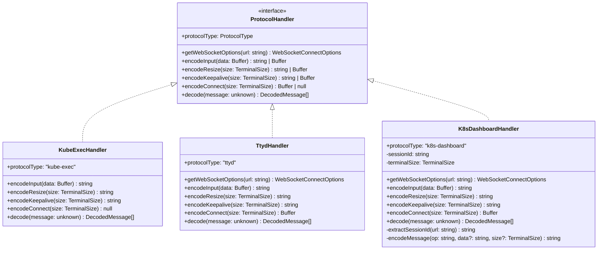
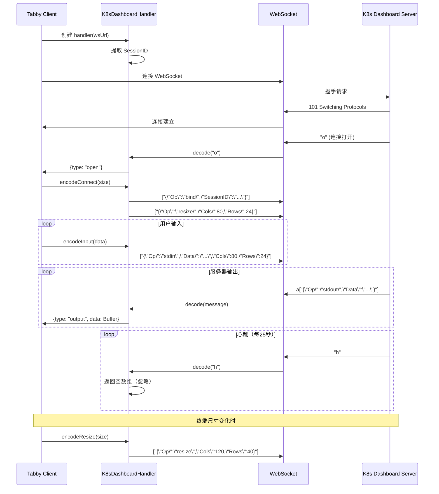

# K8s Dashboard WebSocket 协议支持功能 - 设计文档

## Overview

本文档描述了 K8s Dashboard WebSocket 协议支持功能的技术设计。该功能旨在让 tabby-ws-term 插件能够正确识别和处理 Kubernetes Dashboard 的 WebSocket 终端协议，实现与 K8s Dashboard 的终端会话连接和交互。

### 背景分析

通过对 HAR 文件的分析，K8s Dashboard 使用基于 SockJS 的 WebSocket 协议，具有以下特点：

**消息格式特征：**
- 连接打开消息：单字符 `"o"`
- 心跳消息：单字符 `"h"`，每 25 秒发送一次
- 数据消息：以 `"a"` 前缀开头，后跟 JSON 数组，如 `a["{\"Op\":\"stdout\",\"Data\":\"...\"}"]`

**初始化流程：**
1. 客户端连接 WebSocket
2. 服务器发送 `"o"` 表示连接已建立
3. 客户端发送 bind 消息绑定会话：`["{\"Op\":\"bind\",\"SessionID\":\"xxx\"}"]`
4. 客户端发送初始 resize 消息设置终端尺寸

**认证方式：**
- 通过 Cookie 传递认证信息（jweToken、username、authMode）
- SessionID 通过 URL 查询参数传递（32 位十六进制字符串）

### 设计决策

| 决策 | 理由 |
|------|------|
| 新增 K8sDashboardHandler 类 | 遵循现有架构模式，与 KubeExecHandler 和 TtydHandler 保持一致 |
| 自动协议识别 | 通过 URL 特征自动识别协议类型，提升用户体验 |
| SessionID 提取逻辑 | K8s Dashboard 特有的会话管理机制，需要在连接时绑定 |
| 双层 JSON 编码 | K8s Dashboard 协议使用 JSON 数组包装 JSON 字符串的特殊格式 |

---

## Architecture

### 模块结构

```
src/protocols/
├── interface.ts           # ProtocolHandler 接口定义（不变）
├── types.ts              # 类型定义（新增 k8s-dashboard 类型）
├── index.ts              # 模块入口（更新工厂函数）
├── kube-exec.handler.ts  # kube-exec 协议处理器（不变）
├── ttyd.handler.ts       # ttyd 协议处理器（不变）
├── k8s-dashboard.handler.ts  # 新增：K8s Dashboard 协议处理器
└── __tests__/
    └── k8s-dashboard.handler.spec.ts  # 新增：测试文件
```

### 类图



### 消息处理流程



---

## Components and Interfaces

### K8sDashboardHandler 类

K8s Dashboard 协议处理器，实现 `ProtocolHandler` 接口。

#### 属性

| 属性 | 类型 | 说明 |
|------|------|------|
| `protocolType` | `'k8s-dashboard'` | 协议类型标识 |
| `sessionId` | `string` (私有) | 从 URL 提取的会话 ID |
| `terminalSize` | `TerminalSize` (私有) | 当前终端尺寸，用于编码 stdin 消息 |

#### 方法

##### `getWebSocketOptions(url: string): WebSocketConnectOptions`

从 URL 提取认证信息，构造 WebSocket 连接选项。

**参数：**
- `url`: WebSocket URL，可能包含 `jweToken`、`username`、`authMode` 查询参数

**返回值：**
```typescript
{
    headers: {
        'Cookie': string,    // 认证 Cookie
        'Origin': string,    // 来源 URL
    }
}
```

**处理逻辑：**
1. 解析 URL 获取查询参数
2. 提取 `jweToken`、`username`、`authMode` 参数
3. 组合成 Cookie 字符串（格式：`authMode=token; username=admin; jweToken=xxx`）
4. 构造 Origin 头（从 URL 提取协议和主机）

##### `encodeConnect(size: TerminalSize): Buffer`

编码连接初始化消息，包含 bind 和 resize 操作。

**参数：**
- `size`: 终端尺寸

**返回值：**
- 返回包含 bind 消息的 Buffer
- resize 消息需要在 bind 之后单独发送

**注意：** 根据需求 3.1 和 3.3，bind 和 resize 是两条独立的消息，但 encodeConnect 只返回 bind 消息。resize 需要通过 encodeResize 单独发送。

##### `encodeInput(data: Buffer): string`

编码用户输入数据。

**参数：**
- `data`: 用户输入的原始数据

**返回值：**
- 格式：`["{\"Op\":\"stdin\",\"Data\":\"<data>\",\"Cols\":<cols>,\"Rows\":<rows>}"]`

**处理逻辑：**
1. 将 Buffer 转换为字符串
2. 构造内部 JSON 对象：`{Op: "stdin", Data: data, Cols: cols, Rows: rows}`
3. JSON 序列化内部对象
4. 包装到 JSON 数组中

##### `encodeResize(size: TerminalSize): string`

编码终端尺寸调整消息。

**参数：**
- `size`: 终端尺寸

**返回值：**
- 格式：`["{\"Op\":\"resize\",\"Cols\":<cols>,\"Rows\":<rows>}"]`

##### `encodeKeepalive(size: TerminalSize): string`

编码保活消息。K8s Dashboard 协议使用 resize 消息作为保活。

**参数：**
- `size`: 当前终端尺寸

**返回值：**
- 与 `encodeResize` 相同格式

##### `decode(message: unknown): DecodedMessage[]`

解码服务器消息。

**参数：**
- `message`: WebSocket 接收的原始消息（字符串、Buffer、ArrayBuffer 等）

**返回值：**
- 解码后的消息数组

**处理逻辑：**

```
输入消息 → dataToString() → 判断消息类型
                                  │
                    ┌─────────────┼─────────────┐
                    ↓             ↓             ↓
                 "o" 开头      "h" 精确匹配    "a" 开头
                    │             │             │
                    ↓             ↓             ↓
            返回 {type: "open"} 返回 []     解析 JSON 数组
                                                  │
                                                  ↓
                                          提取数组第一个元素
                                                  │
                                                  ↓
                                           解析内部 JSON
                                                  │
                                    ┌─────────────┼─────────────┐
                                    ↓             ↓             ↓
                              Op="stdout"   Op="toast"    其他/无效
                                    │             │             │
                                    ↓             ↓             ↓
                          返回 {type:    返回 {type:    返回 []
                           "output",     "toast",
                           data: Buffer}  data: string}
```

##### `extractSessionId(url: string): string` (私有)

从 URL 查询参数中提取 SessionID。

**参数：**
- `url`: WebSocket URL

**返回值：**
- 32 位十六进制 SessionID，如果不存在则返回空字符串

##### `encodeMessage(op: string, data?: string, size?: TerminalSize): string` (私有)

通用消息编码方法。

**参数：**
- `op`: 操作类型（stdin、resize、bind）
- `data`: 可选的数据内容
- `size`: 可选的终端尺寸

**返回值：**
- JSON 数组包装的 JSON 字符串

---

## Data Models

### 类型定义扩展

```typescript
// src/protocols/types.ts

/**
 * 支持的协议类型
 */
export type ProtocolType = 'kube-exec' | 'ttyd' | 'k8s-dashboard'

/**
 * K8s Dashboard 协议的操作类型
 */
export const K8S_DASHBOARD_OP = {
    /** 绑定会话操作 */
    BIND: 'bind',
    /** 标准输入操作 */
    STDIN: 'stdin',
    /** 标准输出操作 */
    STDOUT: 'stdout',
    /** 调整大小操作 */
    RESIZE: 'resize',
    /** 服务消息操作 */
    TOAST: 'toast',
} as const

/**
 * K8s Dashboard 协议消息接口
 */
export interface K8sDashboardMessage {
    Op: string
    Data?: string
    SessionID?: string
    Cols?: number
    Rows?: number
}

/**
 * 解码后的消息类型 - 连接打开
 */
export interface OpenMessage {
    type: 'open'
}
```

### 消息格式对比

| 协议 | 输入消息格式 | 输出消息格式 | 初始化流程 |
|------|-------------|-------------|-----------|
| kube-exec | `{"Op":"stdin","Data":"..."}` | `{"Op":"stdout","Data":"..."}` | 无特殊初始化 |
| ttyd | `"0" + data` | `"0" + data` | 发送二进制 JSON 认证 |
| **k8s-dashboard** | `["{\"Op\":\"stdin\",\"Data\":\"...\",\"Cols\":N,\"Rows\":N}"]` | `a["{\"Op\":\"stdout\",\"Data\":\"...\"}"]` | 发送 bind + resize |

---

## Correctness Properties

*属性是系统在所有有效执行中应保持的特征或行为，本质上是关于系统应做什么的形式化声明。属性作为人类可读规范与机器可验证正确性保证之间的桥梁。*

### Property 1: URL 模式识别正确性

*对于任意* WebSocket URL，当路径包含 "/api/sockjs/" 或 "/sockjs/" 子字符串时，协议识别函数 SHALL 返回 `'k8s-dashboard'`。

**Validates: Requirements 1.1**

### Property 2: SessionID 提取正确性

*对于任意* 包含 32 位十六进制查询参数的 WebSocket URL，SessionID 提取函数 SHALL 正确提取该参数值。

**Validates: Requirements 2.1, 2.2**

### Property 3: 无效 SessionID 处理

*对于任意* 不包含有效 32 位十六进制查询参数的 WebSocket URL，SessionID 提取函数 SHALL 返回空字符串。

**Validates: Requirements 2.3**

### Property 4: bind 消息编码正确性

*对于任意* 有效 SessionID，bind 消息编码 SHALL 产生符合格式 `["{\"Op\":\"bind\",\"SessionID\":\"<session_id>\"}"]` 的字符串。

**Validates: Requirements 3.2**

### Property 5: resize 消息编码正确性

*对于任意* 有效的终端尺寸（Cols 和 Rows 为 0 到 9999 的整数），resize 消息编码 SHALL 产生符合格式 `["{\"Op\":\"resize\",\"Cols\":N,\"Rows\":N}"]` 的字符串。

**Validates: Requirements 3.4, 7.2**

### Property 6: stdin 消息编码正确性

*对于任意* 用户输入数据和终端尺寸，stdin 消息编码 SHALL 产生包含正确的 Op、Data、Cols、Rows 字段的 JSON 数组字符串。

**Validates: Requirements 5.1, 5.2**

### Property 7: 消息编码往返一致性

*对于任意* stdin 或 resize 类型的消息，编码后再解码 SHALL 产生相同的 Op 字段值和相同语义的 Data/Cols/Rows 字段值。

**Validates: Requirements 10.6**

### Property 8: stdout 消息解码正确性

*对于任意* 以 "a" 前缀开头、包含 Op 为 "stdout" 且 Data 字段存在的消息，解码 SHALL 返回包含正确 Data 内容的 OutputMessage。

**Validates: Requirements 6.1, 6.2, 6.5**

### Property 9: toast 消息解码正确性

*对于任意* 以 "a" 前缀开头、包含 Op 为 "toast" 且 Data 字段存在的消息，解码 SHALL 返回包含正确 Data 内容的 ToastMessage。

**Validates: Requirements 6.6**

### Property 10: 心跳消息忽略

*对于* 精确匹配 "h" 的消息，解码 SHALL 返回空数组。

**Validates: Requirements 4.1, 4.2, 4.3**

### Property 11: 连接打开消息识别

*对于* 精确匹配 "o" 的消息，解码 SHALL 返回类型为 "open" 的消息对象。

**Validates: Requirements 10.3**

### Property 12: 错误消息处理

*对于任意* 格式错误的消息（JSON 解析失败、缺少必要字段等），解码 SHALL 返回空数组或进行降级处理（返回原始内容）。

**Validates: Requirements 6.3, 6.7, 6.8, 6.9**

### Property 13: 多格式输入解码一致性

*对于任意* 消息内容，使用字符串、Buffer、ArrayBuffer、Uint8Array 等不同格式输入时，解码结果 SHALL 一致。

**Validates: Requirements 10.2**

### Property 14: 认证参数提取正确性

*对于任意* 包含 jweToken、username、authMode 查询参数的 URL，getWebSocketOptions SHALL 正确提取并组合到 Cookie 头中。

**Validates: Requirements 9.1, 9.2, 9.3, 9.4, 9.5**

### 属性反射

经过审查，上述属性已经覆盖了核心功能点，没有明显的冗余。部分属性可以合并测试：

- **Property 8 和 Property 9** 可以合并为一个 "数据消息解码正确性" 属性，但分开描述更清晰
- **Property 4、5、6** 可以抽象为 "消息编码格式正确性"，但按消息类型分开更易于实现测试
- **Property 10 和 Property 11** 是特殊的单字符消息处理，分开描述更清晰

---

## Error Handling

### 错误类型

| 错误场景 | 处理策略 | 返回值 |
|---------|---------|--------|
| JSON 解析失败 | 降级处理，返回原始内容 | `[{type: 'output', data: Buffer}]` |
| JSON 数组为空 | 忽略消息 | `[]` |
| 缺少 Op 字段 | 忽略消息 | `[]` |
| 未知 Op 值 | 忽略消息 | `[]` |
| 缺少 Data 字段 | 忽略消息 | `[]` |
| Data 为 null | 忽略消息 | `[]` |
| 无效 SessionID | 使用空字符串 | 正常编码，SessionID 为空 |
| 解码异常 | 捕获异常，返回空数组 | `[]` |

### 异常处理策略

```typescript
// 解码方法中的异常处理示例
decode(message: unknown): DecodedMessage[] {
    try {
        const text = this.dataToString(message)
        
        // 处理特殊消息
        if (text === 'o') {
            return [{ type: 'open' }]
        }
        if (text === 'h') {
            return []
        }
        
        // 处理数据消息
        if (text.startsWith('a')) {
            // ... 解析逻辑
        }
        
        return []
    } catch (error) {
        // 所有异常情况返回空数组
        this.logger?.error('Decode error:', error)
        return []
    }
}
```

---

## Testing Strategy

### 测试框架

- **测试框架**: Vitest
- **属性测试库**: fast-check
- **最小迭代次数**: 100 次/属性

### 测试分类

#### 1. 单元测试

用于验证特定示例和边缘情况。

| 测试场景 | 测试类型 | 说明 |
|---------|---------|------|
| protocolType 属性 | EXAMPLE | 验证返回 'k8s-dashboard' |
| 工厂函数返回正确实例 | EXAMPLE | createProtocolHandler('k8s-dashboard') |
| 类型验证函数 | EXAMPLE | isValidProtocolType('k8s-dashboard') |
| 心跳消息 "h" 解码 | EXAMPLE | 返回空数组 |
| 连接打开消息 "o" 解码 | EXAMPLE | 返回 open 类型消息 |
| 空 Buffer 编码 | EDGE_CASE | 验证空数据编码有效 |
| 零尺寸终端 | EDGE_CASE | 验证 Cols=0, Rows=0 编码正确 |

#### 2. 属性测试

用于验证通用正确性属性。

```typescript
// 示例：stdin 消息编码正确性属性测试
describe('Property 6: stdin 消息编码正确性', () => {
    const handler = new K8sDashboardHandler()
    
    it('encodeInput 应返回有效的 JSON 数组格式', () => {
        fc.assert(
            fc.property(
                fc.string({ maxLength: 10000 }),
                fc.integer({ min: 1, max: 999 }),
                fc.integer({ min: 1, max: 999 }),
                (data, cols, rows) => {
                    const size = { columns: cols, rows: rows }
                    handler['terminalSize'] = size
                    const encoded = handler.encodeInput(Buffer.from(data))
                    
                    // 验证格式
                    if (!encoded.startsWith('["')) return false
                    if (!encoded.endsWith('"]')) return false
                    
                    // 解析验证
                    const outerArray = JSON.parse(encoded)
                    if (!Array.isArray(outerArray) || outerArray.length !== 1) return false
                    
                    const innerObj = JSON.parse(outerArray[0])
                    return innerObj.Op === 'stdin' && innerObj.Data === data
                        && innerObj.Cols === cols && innerObj.Rows === rows
                }
            ),
            { numRuns: 100 }
        )
    })
})
```

#### 3. 集成测试

用于验证 WebSocket 连接和会话管理。

| 测试场景 | 测试类型 | 说明 |
|---------|---------|------|
| WebSocket 连接建立 | INTEGRATION | 使用 mock server 验证连接流程 |
| bind 消息发送时序 | INTEGRATION | 验证收到 "o" 后发送 bind |
| resize 消息发送时序 | INTEGRATION | 验证 bind 后发送 resize |
| 连接失败处理 | INTEGRATION | 验证不发送消息 |
| 超时处理 | INTEGRATION | 验证日志记录 |

### 测试文件结构

```typescript
// src/protocols/__tests__/k8s-dashboard.handler.spec.ts

describe('K8sDashboardHandler', () => {
    describe('Unit Tests', () => {
        describe('protocolType', () => { /* ... */ })
        describe('getWebSocketOptions', () => { /* ... */ })
        describe('encodeConnect', () => { /* ... */ })
        describe('encodeInput', () => { /* ... */ })
        describe('encodeResize', () => { /* ... */ })
        describe('decode', () => { /* ... */ })
    })
    
    describe('Property-Based Tests', () => {
        describe('Property 1: URL 模式识别正确性', () => { /* ... */ })
        describe('Property 2: SessionID 提取正确性', () => { /* ... */ })
        // ... 其他属性测试
    })
    
    describe('Edge Cases', () => {
        // 边缘情况测试
    })
})
```

### 测试覆盖率目标

| 指标 | 目标值 |
|------|--------|
| 行覆盖率 | ≥ 90% |
| 分支覆盖率 | ≥ 85% |
| 函数覆盖率 | 100% |
| 属性测试迭代次数 | ≥ 100 次/属性 |

---

## 实现注意事项

### 1. SessionID 存储

由于 `encodeConnect` 方法需要使用 SessionID，但 `ProtocolHandler` 接口不传递 URL 参数，因此需要在构造函数中接收 URL 并提取 SessionID：

```typescript
class K8sDashboardHandler implements ProtocolHandler {
    private sessionId: string
    
    constructor(wsUrl?: string) {
        this.sessionId = wsUrl ? this.extractSessionId(wsUrl) : ''
    }
}
```

但这会导致工厂函数需要修改。替代方案是在 `encodeConnect` 中使用预先存储的 `sessionId`，由调用方（session.ts）在创建 handler 后设置。

**推荐方案**：修改工厂函数签名，允许传递 URL：

```typescript
export function createProtocolHandler(
    protocolType: ProtocolType,
    wsUrl?: string
): ProtocolHandler {
    switch (protocolType) {
        case 'k8s-dashboard':
            return new K8sDashboardHandler(wsUrl)
        // ...
    }
}
```

### 2. 协议识别函数位置

协议识别逻辑应该放在 `normalizeProtocolType` 函数中，或者在 `session.ts` 中单独处理：

```typescript
// 方案 1：扩展 normalizeProtocolType
export function normalizeProtocolType(
    value: unknown,
    wsUrl?: string
): ProtocolType {
    if (isValidProtocolType(value)) {
        return value
    }
    // 自动识别
    if (wsUrl && isK8sDashboardUrl(wsUrl)) {
        return 'k8s-dashboard'
    }
    return 'kube-exec'
}

// 方案 2：新增自动识别函数
export function detectProtocolType(wsUrl: string): ProtocolType {
    if (isK8sDashboardUrl(wsUrl)) {
        return 'k8s-dashboard'
    }
    return 'kube-exec'
}
```

**推荐方案 2**，保持职责分离，自动识别与类型规范化分开。

### 3. encodeConnect 返回值

根据需求 3.1 和 3.3，初始化需要发送两条消息（bind 和 resize）。由于 `encodeConnect` 返回单个 Buffer，建议：

- `encodeConnect` 返回 bind 消息
- resize 消息通过 `encodeResize` 返回，由 session.ts 在 bind 之后发送

### 4. 终端尺寸跟踪

stdin 消息需要包含终端尺寸。有两种方案：

1. **状态存储**：在 handler 内部存储终端尺寸，encodeInput 时使用
2. **参数传递**：修改 `ProtocolHandler` 接口，encodeInput 接收尺寸参数

方案 2 需要修改接口，影响现有实现。**推荐方案 1**，在 `encodeResize` 时更新内部状态。

---

## 实现任务

实现任务将在后续的 tasks.md 中详细定义，主要包含：

1. 更新类型定义，添加 `'k8s-dashboard'` 到 `ProtocolType`
2. 实现 `K8sDashboardHandler` 类
3. 更新工厂函数和验证函数
4. 添加协议自动识别逻辑
5. 编写单元测试和属性测试
6. 更新 session.ts 支持新协议
