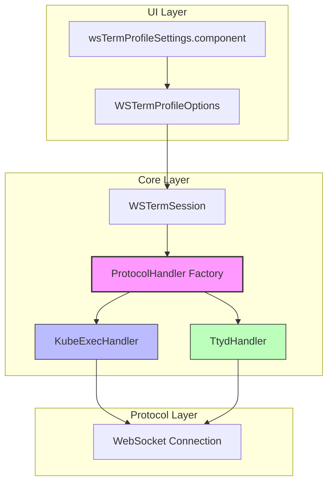
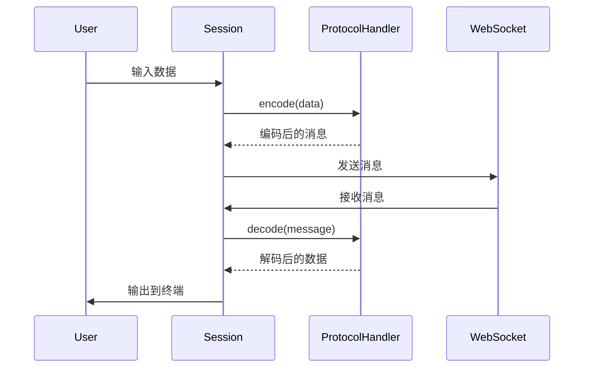
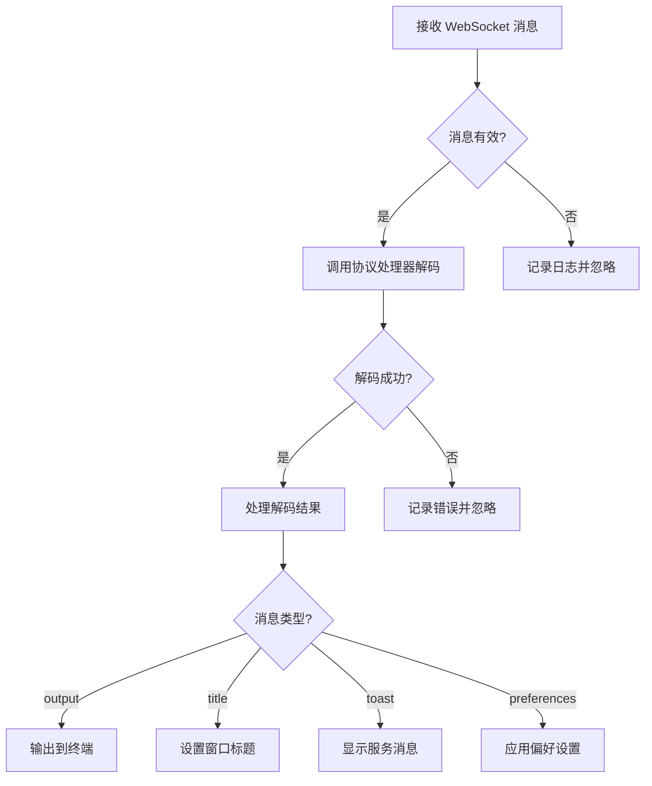

# Design Document: ttyd-protocol-support

## Overview

本设计文档描述了为 tabby-ws-term 插件添加 ttyd 协议支持的技术实现方案。核心目标是引入协议处理器抽象层，统一处理 WebSocket 内部的数据格式，使后续添加其他协议类型变得简单。

### 设计目标

1. **协议抽象**：定义统一的协议处理器接口，隔离不同协议的实现细节
2. **向后兼容**：现有 kube-exec 协议的行为保持不变，默认值和消息格式完全兼容
3. **易于扩展**：添加新协议只需实现协议处理器接口，无需修改核心会话逻辑
4. **可测试性**：协议处理逻辑与网络层分离，便于单元测试和属性测试

### 关键设计决策

| 决策 | 理由 |
|------|------|
| 使用策略模式实现协议处理器 | 不同协议的消息格式差异较大，策略模式可以完全隔离实现 |
| 协议处理器是无状态的纯函数 | 便于测试，避免会话状态与协议状态耦合 |
| 协议类型使用字符串枚举 | 与现有 Profile 配置风格一致，便于序列化和验证 |

---

## Architecture

### 系统架构图



### 组件交互流程



### 目录结构

```
src/
├── protocols/                    # 协议处理器模块
│   ├── index.ts                  # 模块导出和工厂函数
│   ├── types.ts                  # 协议相关类型定义
│   ├── interface.ts              # ProtocolHandler 接口定义
│   ├── kube-exec.handler.ts      # kube-exec 协议实现
│   └── ttyd.handler.ts           # ttyd 协议实现
├── profiles.ts                   # Profile 定义（添加 protocol 字段）
├── session.ts                    # 会话管理（使用协议处理器）
└── components/
    └── wsTermProfileSettings.component.pug  # 配置界面（添加协议选择）
```

---

## Components and Interfaces

### ProtocolHandler 接口

协议处理器的核心接口，定义了所有协议必须实现的方法。

```typescript
// src/protocols/interface.ts

import { TerminalSize, DecodedMessage, ProtocolType } from './types'

/**
 * 协议处理器接口
 * 所有协议处理器必须实现此接口
 */
export interface ProtocolHandler {
    /**
     * 协议类型标识
     */
    readonly protocolType: ProtocolType

    /**
     * 编码用户输入数据
     * @param data 用户输入的原始数据
     * @returns 编码后可发送的消息
     */
    encodeInput(data: Buffer): string | Buffer

    /**
     * 编码终端大小调整消息
     * @param size 终端尺寸
     * @returns 编码后的 resize 消息
     */
    encodeResize(size: TerminalSize): string | Buffer

    /**
     * 编码保活消息
     * @param size 当前终端尺寸（某些协议需要）
     * @returns 编码后的保活消息
     */
    encodeKeepalive(size: TerminalSize): string | Buffer

    /**
     * 解码服务器消息
     * @param message 从 WebSocket 接收的原始消息
     * @returns 解码后的消息数组（一条原始消息可能产生多个输出）
     */
    decode(message: WebSocket.Data): DecodedMessage[]
}
```

### 类型定义

```typescript
// src/protocols/types.ts

/**
 * 支持的协议类型
 */
export type ProtocolType = 'kube-exec' | 'ttyd'

/**
 * 终端尺寸
 */
export interface TerminalSize {
    columns: number
    rows: number
}

/**
 * 解码后的消息类型
 */
export type DecodedMessage = 
    | { type: 'output'; data: Buffer }
    | { type: 'title'; data: string }
    | { type: 'toast'; data: string }
    | { type: 'preferences'; data: Record<string, unknown> }

/**
 * ttyd 协议的消息类型前缀
 */
export const TTYD_PREFIX = {
    INPUT: '0',
    RESIZE: '1',
    PAUSE: '2',
    RESUME: '3',
    OUTPUT: '0',
    SET_TITLE: '1',
    SET_PREFERENCES: '2',
} as const

/**
 * kube-exec 协议的操作类型
 */
export const KUBE_EXEC_OP = {
    STDIN: 'stdin',
    STDOUT: 'stdout',
    RESIZE: 'resize',
    TOAST: 'toast',
} as const
```

### KubeExecHandler 实现

```typescript
// src/protocols/kube-exec.handler.ts

import { ProtocolHandler } from './interface'
import { TerminalSize, DecodedMessage, KUBE_EXEC_OP } from './types'

interface KubeExecMessage {
    Op: string
    Data?: string
    Rows?: number
    Cols?: number
}

export class KubeExecHandler implements ProtocolHandler {
    readonly protocolType = 'kube-exec' as const

    encodeInput(data: Buffer): string {
        const msg: KubeExecMessage = {
            Op: KUBE_EXEC_OP.STDIN,
            Data: data.toString(),
        }
        return JSON.stringify(msg)
    }

    encodeResize(size: TerminalSize): string {
        const msg: KubeExecMessage = {
            Op: KUBE_EXEC_OP.RESIZE,
            Cols: size.columns,
            Rows: size.rows,
        }
        return JSON.stringify(msg)
    }

    encodeKeepalive(size: TerminalSize): string {
        // kube-exec 使用 resize 消息作为保活
        return this.encodeResize(size)
    }

    decode(data: WebSocket.Data): DecodedMessage[] {
        const text = this.dataToString(data)
        const results: DecodedMessage[] = []

        try {
            const msg: KubeExecMessage = JSON.parse(text)

            switch (msg.Op) {
                case KUBE_EXEC_OP.STDOUT:
                    if (msg.Data) {
                        results.push({ type: 'output', data: Buffer.from(msg.Data) })
                    }
                    break
                case KUBE_EXEC_OP.TOAST:
                    if (msg.Data) {
                        results.push({ type: 'toast', data: msg.Data })
                    }
                    break
                default:
                    // 忽略其他操作类型
                    break
            }
        } catch {
            // 非 JSON 消息，作为原始输出处理
            results.push({ type: 'output', data: Buffer.from(text) })
        }

        return results
    }

    private dataToString(data: WebSocket.Data): string {
        if (typeof data === 'string') {
            return data
        }
        if (Buffer.isBuffer(data)) {
            return data.toString()
        }
        if (Array.isArray(data)) {
            return Buffer.concat(data).toString()
        }
        return Buffer.from(data).toString()
    }
}
```

### TtydHandler 实现

```typescript
// src/protocols/ttyd.handler.ts

import { ProtocolHandler } from './interface'
import { TerminalSize, DecodedMessage, TTYD_PREFIX } from './types'

export class TtydHandler implements ProtocolHandler {
    readonly protocolType = 'ttyd' as const

    encodeInput(data: Buffer): string {
        return TTYD_PREFIX.INPUT + data.toString()
    }

    encodeResize(size: TerminalSize): string {
        return TTYD_PREFIX.RESIZE + JSON.stringify({
            columns: size.columns,
            rows: size.rows,
        })
    }

    encodeKeepalive(size: TerminalSize): string {
        // ttyd 使用 resize 消息作为保活
        return this.encodeResize(size)
    }

    decode(data: WebSocket.Data): DecodedMessage[] {
        const text = this.dataToString(data)
        
        if (text.length === 0) {
            return []
        }

        const prefix = text[0]
        const payload = text.slice(1)

        switch (prefix) {
            case TTYD_PREFIX.OUTPUT:
                return [{ type: 'output', data: Buffer.from(payload) }]
            
            case TTYD_PREFIX.SET_TITLE:
                return [{ type: 'title', data: payload }]
            
            case TTYD_PREFIX.SET_PREFERENCES:
                try {
                    const prefs = JSON.parse(payload)
                    return [{ type: 'preferences', data: prefs }]
                } catch {
                    // JSON 解析失败，忽略此消息
                    return []
                }
            
            default:
                // 未知前缀，忽略消息
                return []
        }
    }

    private dataToString(data: WebSocket.Data): string {
        if (typeof data === 'string') {
            return data
        }
        if (Buffer.isBuffer(data)) {
            return data.toString()
        }
        if (Array.isArray(data)) {
            return Buffer.concat(data).toString()
        }
        return Buffer.from(data).toString()
    }
}
```

### 协议处理器工厂

```typescript
// src/protocols/index.ts

import { ProtocolHandler } from './interface'
import { ProtocolType } from './types'
import { KubeExecHandler } from './kube-exec.handler'
import { TtydHandler } from './ttyd.handler'

export * from './interface'
export * from './types'
export * from './kube-exec.handler'
export * from './ttyd.handler'

/**
 * 创建协议处理器实例
 * @param protocolType 协议类型
 * @returns 对应的协议处理器实例
 */
export function createProtocolHandler(protocolType: ProtocolType): ProtocolHandler {
    switch (protocolType) {
        case 'kube-exec':
            return new KubeExecHandler()
        case 'ttyd':
            return new TtydHandler()
        default:
            // 类型保护，确保处理所有可能的值
            const _exhaustiveCheck: never = protocolType
            throw new Error(`Unknown protocol type: ${_exhaustiveCheck}`)
    }
}

/**
 * 验证协议类型是否有效
 * @param value 待验证的值
 * @returns 是否为有效的协议类型
 */
export function isValidProtocolType(value: unknown): value is ProtocolType {
    return value === 'kube-exec' || value === 'ttyd'
}

/**
 * 规范化协议类型
 * @param value 输入值
 * @returns 有效的协议类型（无效值返回默认值）
 */
export function normalizeProtocolType(value: unknown): ProtocolType {
    if (isValidProtocolType(value)) {
        return value
    }
    return 'kube-exec'
}
```

---

## Data Models

### WSTermProfileOptions 扩展

```typescript
// src/profiles.ts（修改后）

export interface WSTermProfileOptions {
    /** WebSocket 连接 URL */
    wsUrl: string
    
    /** 启动命令 */
    shell?: string
    
    /** 断开连接前确认 */
    confirmDisconnect?: boolean
    
    /** 保活间隔（毫秒），0 表示禁用 */
    keepaliveInterval?: number
    
    /** 协议类型，默认为 'kube-exec' */
    protocol?: ProtocolType
}
```

### 配置默认值

```typescript
// src/profiles.ts 中的 configDefaults

configDefaults = {
    options: {
        wsUrl: '',
        shell: '',
        confirmDisconnect: false,
        keepaliveInterval: 15000,
        protocol: 'kube-exec',  // 新增默认值
    },
    clearServiceMessagesOnConnect: false,
}
```

### 数据迁移

现有的 Profile 配置不包含 `protocol` 字段，通过 `normalizeProtocolType` 函数自动处理：

- `undefined` → `'kube-exec'`
- `null` → `'kube-exec'`
- `''` → `'kube-exec'`
- `'invalid'` → `'kube-exec'`
- `'kube-exec'` → `'kube-exec'`
- `'ttyd'` → `'ttyd'`

---

## Error Handling

### 协议处理错误

| 错误场景 | 处理方式 | 日志级别 |
|---------|---------|---------|
| kube-exec 非 JSON 消息 | 作为原始输出处理 | DEBUG |
| kube-exec 未知 Op 类型 | 忽略消息 | DEBUG |
| ttyd 未知前缀 | 忽略消息 | WARN |
| ttyd 偏好设置 JSON 解析失败 | 忽略消息 | ERROR |
| 无效协议类型 | 使用默认值 | INFO |

### 错误处理流程



---

## Testing Strategy

### 测试层次

1. **单元测试**：验证协议处理器的编码/解码逻辑
2. **属性测试**：验证编解码的通用属性（如 round-trip）
3. **集成测试**：验证会话与协议处理器的协作

### 单元测试用例

#### KubeExecHandler

- 测试 `encodeInput` 生成正确的 JSON 格式
- 测试 `encodeResize` 生成正确的 JSON 格式
- 测试 `decode` 正确解析 stdout 消息
- 测试 `decode` 正确解析 toast 消息
- 测试 `decode` 处理非 JSON 消息的降级行为
- 测试 `decode` 忽略未知 Op 类型

#### TtydHandler

- 测试 `encodeInput` 添加 '0' 前缀
- 测试 `encodeResize` 添加 '1' 前缀和 JSON
- 测试 `decode` 正确处理 '0' 前缀的输出消息
- 测试 `decode` 正确处理 '1' 前缀的标题消息
- 测试 `decode` 正确处理 '2' 前缀的偏好设置
- 测试 `decode` 忽略未知前缀

#### 工厂函数

- 测试 `createProtocolHandler` 为各协议类型创建正确的处理器
- 测试 `isValidProtocolType` 正确验证协议类型
- 测试 `normalizeProtocolType` 正确规范化各种输入

### 属性测试

协议处理器是纯函数，非常适合属性测试。下面分析哪些验收标准适合属性测试。

---

## Correctness Properties

*属性是系统在所有有效执行中应保持的特征或行为——本质上，是关于系统应该做什么的形式化陈述。属性作为人类可读规范与机器可验证正确性保证之间的桥梁。*

本功能涉及协议处理器的编码/解码逻辑，这些是纯函数，非常适合属性测试。

### Property 1: 协议类型规范化

*对于任意*输入值，`normalizeProtocolType` 函数 SHALL 返回有效的协议类型，且当输入不是 "kube-exec" 或 "ttyd" 时返回默认值 "kube-exec"。

**Validates: Requirements 1.4, 6.3, 9.4**

### Property 2: kube-exec 输入编码正确性

*对于任意*用户输入数据，`KubeExecHandler.encodeInput` SHALL 返回有效的 JSON 字符串，且解析后包含 `Op: "stdin"` 和正确的 `Data` 字段。

**Validates: Requirements 2.2**

### Property 3: kube-exec resize 编码正确性

*对于任意*有效的终端尺寸（列数和行数为正整数），`KubeExecHandler.encodeResize` SHALL 返回有效的 JSON 字符串，且解析后包含 `Op: "resize"` 和正确的 `Cols`、`Rows` 字段。

**Validates: Requirements 2.3**

### Property 4: kube-exec 解码正确性

*对于任意*格式为 `{"Op":"stdout","Data":"..."}` 或 `{"Op":"toast","Data":"..."}` 的有效 JSON 消息，`KubeExecHandler.decode` SHALL 正确提取 Data 内容并返回对应类型的解码消息。

**Validates: Requirements 2.4, 2.5**

### Property 5: kube-exec 非 JSON 消息降级

*对于任意*非 JSON 格式的消息，`KubeExecHandler.decode` SHALL 将消息作为原始输出处理，返回 `output` 类型的解码消息。

**Validates: Requirements 2.1**

### Property 6: ttyd 输入编码正确性

*对于任意*用户输入数据，`TtydHandler.encodeInput` SHALL 返回以 '0' 开头的字符串，且前缀之后的内容与原始数据一致。

**Validates: Requirements 3.1**

### Property 7: ttyd resize 编码正确性

*对于任意*有效的终端尺寸，`TtydHandler.encodeResize` 和 `TtydHandler.encodeKeepalive` SHALL 返回以 '1' 开头的字符串，且前缀之后是包含正确 `columns` 和 `rows` 字段的有效 JSON。

**Validates: Requirements 3.2, 7.1**

### Property 8: ttyd 解码正确性

*对于任意*以 '0'、'1'、'2' 开头的有效消息，`TtydHandler.decode` SHALL 正确解析消息类型并提取内容：
- '0' 开头 → 返回 `output` 类型消息
- '1' 开头 → 返回 `title` 类型消息
- '2' 开头（有效 JSON）→ 返回 `preferences` 类型消息

**Validates: Requirements 4.1, 4.2, 4.3**

### Property 9: ttyd 无效消息忽略

*对于任意*不以 '0'、'1'、'2' 开头的消息，或以 '2' 开头但包含无效 JSON 的消息，`TtydHandler.decode` SHALL 返回空数组。

**Validates: Requirements 4.4, 4.5**

### Property 10: 编码解码往返一致性

*对于任意*用户输入数据和终端尺寸，协议处理器的编码和解码操作 SHALL 满足以下往返属性：
- kube-exec: `decode(encodeInput(data))` 提取的 Data 与原始数据一致（当作为 stdout 消息解码时）
- ttyd: `decode(encodeInput(data))` 提取的输出数据与原始数据一致

**Validates: Requirements 2.2, 2.4, 3.1, 4.1**

---

## Testing Strategy (Detailed)

### 属性测试配置

使用 fast-check 或类似的属性测试库：

```typescript
// 示例：kube-exec 编码属性测试
import * as fc from 'fast-check'

describe('KubeExecHandler Properties', () => {
    const handler = new KubeExecHandler()
    
    it('Property 2: encodeInput produces valid JSON with correct structure', () => {
        fc.assert(
            fc.property(
                fc.string({ maxLength: 10000 }),
                (input) => {
                    const encoded = handler.encodeInput(Buffer.from(input))
                    const parsed = JSON.parse(encoded)
                    return parsed.Op === 'stdin' && parsed.Data === input
                }
            ),
            { numRuns: 100 }
        )
    })
})
```

### 测试文件组织

```
src/protocols/__tests__/
├── kube-exec.handler.spec.ts    # kube-exec 单元测试和属性测试
├── ttyd.handler.spec.ts         # ttyd 单元测试和属性测试
└── index.spec.ts                # 工厂函数测试
```

### 测试标签格式

每个属性测试使用以下标签格式：

```
**Feature: ttyd-protocol-support, Property N: [property name]**
```

### 覆盖率目标

- 协议处理器核心逻辑：100%
- 工厂函数：100%
- 会话集成：80%+

